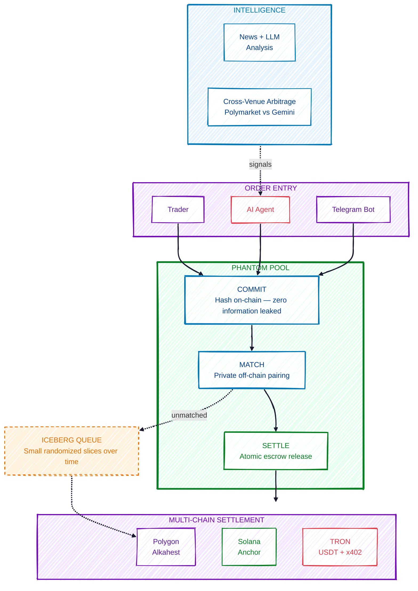

# Phantom Pool — Architecture

```mermaid
%%{init: {'theme': 'default', 'look': 'handDrawn', 'themeVariables': {'primaryColor': '#f0f0f5', 'primaryTextColor': '#1a1a2e', 'lineColor': '#1a1a2e', 'fontSize': '14px'}}}%%

flowchart TB

    subgraph INTEL["INTELLIGENCE"]
        direction LR
        NEWS["News + LLM<br/>Analysis"]
        ARB["Cross-Venue Arbitrage<br/>Polymarket vs Gemini"]
    end

    subgraph ENTRY["ORDER ENTRY"]
        direction LR
        TRADER["Trader"]
        AGENT["AI Agent"]
        BOT["Telegram Bot"]
    end

    INTEL -.->|signals| AGENT

    subgraph ENGINE["PHANTOM POOL"]
        COMMIT["COMMIT<br/>Hash on-chain — zero information leaked"]
        MATCH["MATCH<br/>Private off-chain pairing"]
        SETTLE["SETTLE<br/>Atomic escrow release"]
        COMMIT --> MATCH --> SETTLE
    end

    TRADER & AGENT & BOT --> COMMIT

    MATCH -.->|unmatched| ICE["ICEBERG QUEUE<br/>Small randomized slices over time"]

    subgraph CHAINS["MULTI-CHAIN SETTLEMENT"]
        direction LR
        POLY["Polygon<br/>Alkahest"]
        SOL["Solana<br/>Anchor"]
        TRON["TRON<br/>USDT + x402"]
    end

    SETTLE --> CHAINS
    ICE -.-> POLY

    style INTEL fill:#e8f4fd,stroke:#0077b6,color:#0077b6,stroke-width:2px
    style NEWS fill:#ffffff,stroke:#0077b6,color:#023e8a
    style ARB fill:#ffffff,stroke:#0077b6,color:#023e8a

    style ENTRY fill:#f3e8ff,stroke:#7209b7,color:#7209b7,stroke-width:2px
    style TRADER fill:#ffffff,stroke:#7209b7,color:#5a189a
    style AGENT fill:#ffffff,stroke:#e63946,color:#e63946
    style BOT fill:#ffffff,stroke:#7209b7,color:#5a189a

    style ENGINE fill:#e6fff0,stroke:#087f23,color:#087f23,stroke-width:3px
    style COMMIT fill:#ffffff,stroke:#0077b6,color:#023e8a,stroke-width:2px
    style MATCH fill:#ffffff,stroke:#0077b6,color:#023e8a,stroke-width:2px
    style SETTLE fill:#ffffff,stroke:#087f23,color:#087f23,stroke-width:2px

    style ICE fill:#fff3e0,stroke:#e76f00,color:#e76f00,stroke-dasharray:5 5

    style CHAINS fill:#f3e8ff,stroke:#7209b7,color:#7209b7,stroke-width:2px
    style POLY fill:#ffffff,stroke:#7209b7,color:#5a189a
    style SOL fill:#ffffff,stroke:#087f23,color:#087f23
    style TRON fill:#ffffff,stroke:#e63946,color:#e63946

    linkStyle default stroke:#1a1a2e,stroke-width:2px
```
