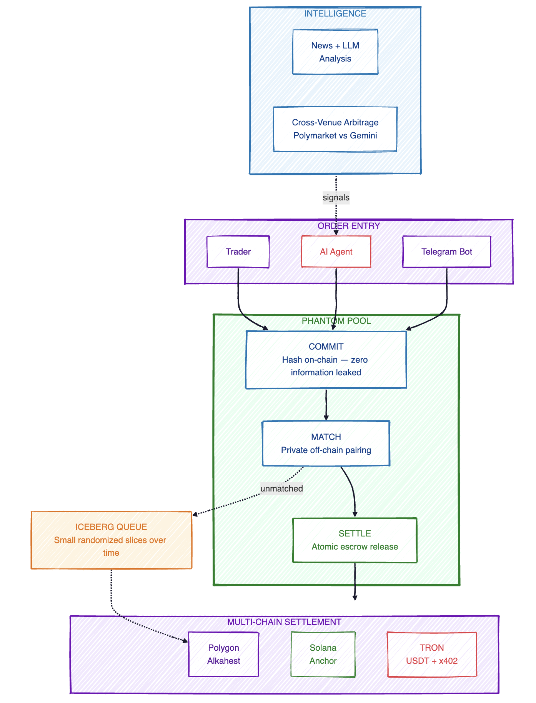

# Phantom Pool

### The First Privacy-Preserving Dark Pool for Prediction Markets

<p align="center">
  <a href="https://frontend-rho-opal-90.vercel.app">Live Website</a>
</p>
<p align="center">
  <a href="https://www.loom.com/share/8a111686672b4ffb8d02989a6dc9dda8">Live Demo</a>
</p>

---

## The Problem

On transparent prediction markets like Polymarket, every large trade is visible on-chain the moment it's submitted. Front-running bots detect whale orders within seconds, copy-traders pile in, and the price moves before the original order fills. A $50,000 position can easily lose **$4,000+** to slippage and information leakage.

Dark pools solve this in traditional finance — **$4.5 trillion per day** flows through equities dark pools, roughly 40% of all US equity volume. Prediction markets have **zero** privacy infrastructure today.

---

## The Solution

Phantom Pool lets traders execute large prediction market positions without revealing order size or direction on-chain.

- **Commit-Reveal Orders** — Traders submit a salted hash on-chain. No size, no direction, no limit price — just an opaque commitment. Details are only revealed after a counterparty is found.

- **Off-Chain Matching** — A price-time priority engine pairs buyers and sellers privately. Matched pairs settle atomically through conditional escrows. Zero MEV exposure.

- **Iceberg Execution** — Unmatched residuals are split into small, randomly-timed slices and drip-fed to the open market. Configurable slice size and timing jitter prevent pattern detection.

- **AI News Agent** — An LLM-powered agent monitors real-time news, calculates predictive edge against current market prices, and routes high-confidence trades through the dark pool first — capturing alpha before the market reacts.

- **Cross-Venue Arbitrage** — Compares prices between Polymarket and Gemini Prediction Markets in real-time, flagging mispricings and routing arbitrage trades privately.

---

## Architecture

<p align="center">
  
</p>

---

## Features

### Dark Pool Trading
- Commit-reveal protocol prevents front-running — only a hash is visible on-chain until settlement
- Price-time priority matching pairs counterparties off-chain with zero information leakage
- Atomic settlement through Alkahest conditional escrows on Polygon
- Iceberg orders split large positions into small, jittered slices to mask true order size

### AI Trading Agent
- Monitors news feeds in real-time via NewsAPI
- LLM analysis scores each headline for market impact, confidence, and edge
- Generates actionable trade signals with affected market identification
- Routes profitable trades through the dark pool before the open market reacts
- All decisions stored on Filecoin for verifiable, CID-backed reputation

### Cross-Venue Intelligence
- Real-time price comparison between Polymarket and Gemini Prediction Markets
- Flags arbitrage opportunities when the same event trades at different prices across venues
- Routes arbitrage trades through the dark pool to capture spreads privately

### x402 Agentic Payments
- Any AI agent can access the dark pool by paying a micropayment per order — no API keys, no subscriptions
- HTTP 402 Payment Required flow with on-chain verification on both Solana and TRON
- Fully autonomous agent-to-agent commerce

### Multi-Chain Settlement
- **Polygon** — Alkahest conditional escrow arbiter
- **Solana** — Anchor program with PDA-based order storage and SPL token escrow
- **TRON** — USDT settlement with x402-style micropayments on Nile testnet

---

## Dashboard

Five-tab terminal-style interface:

| Tab | Description |
|-----|-------------|
| **Home** | Browse live prediction markets from Polymarket and Gemini with real-time price tickers |
| **Dashboard** | Iceberg engine visualization, settlement animations, execution log, order depth chart |
| **Trade** | 4-step order wizard — configure, iceberg parameters, commit hash, reveal and settle |
| **Agent** | AI agent reputation, live news signal feed, cross-venue arbitrage tracker |
| **TRON** | x402 payment flow — trader submits order, pays micropayment, market maker earns fees |

---

## Tech Stack

| Layer | Technology |
|-------|------------|
| Frontend | Next.js 15, React 19, TypeScript |
| Backend | Node.js, Express, TypeScript, ethers.js v6, WebSocket |
| Smart Contracts | Solidity 0.8.20 (Hardhat), Anchor 0.32 (Solana), TronIDE |
| AI | OpenRouter GPT-4o-mini — news analysis and intent extraction |
| Storage | Filecoin via Synapse SDK — agent memory and verifiable reputation |
| Bot | grammy.js (Telegram) with NLP order flow |

---

## Quick Start

```bash
git clone https://github.com/weitaosu/penn_hackathon.git
cd penn_hackathon

# Backend
cd backend && npm install && npm run dev    # starts on :3001

# Frontend (separate terminal)
cd frontend && npm install && npm run dev   # starts on :3000

# Telegram bot (separate terminal)
cd bot && npm install && npm run dev
```

---

## API

| Method | Path | Description |
|--------|------|-------------|
| POST | `/api/orders/submit` | Submit a dark pool order |
| POST | `/api/orders/reveal` | Reveal a committed order |
| GET | `/api/orders/:id` | Order status and match info |
| GET | `/api/markets` | Browse Polymarket markets |
| GET | `/api/gemini/events` | Gemini prediction market events |
| GET | `/api/gemini/cross-venue` | Cross-venue arbitrage opportunities |
| GET | `/api/news/signals` | AI agent trade signals |
| GET | `/api/agent/reputation` | Filecoin-backed agent reputation |
| POST | `/api/solana/orders/submit` | x402-gated order submission (Solana) |
| POST | `/api/tron/orders/submit` | x402-gated order submission (TRON) |
| WS | `/ws` | Real-time order events |

---

<p align="center">
  Built at University of Pennsylvania Blockchain Hackathon '26
</p>
